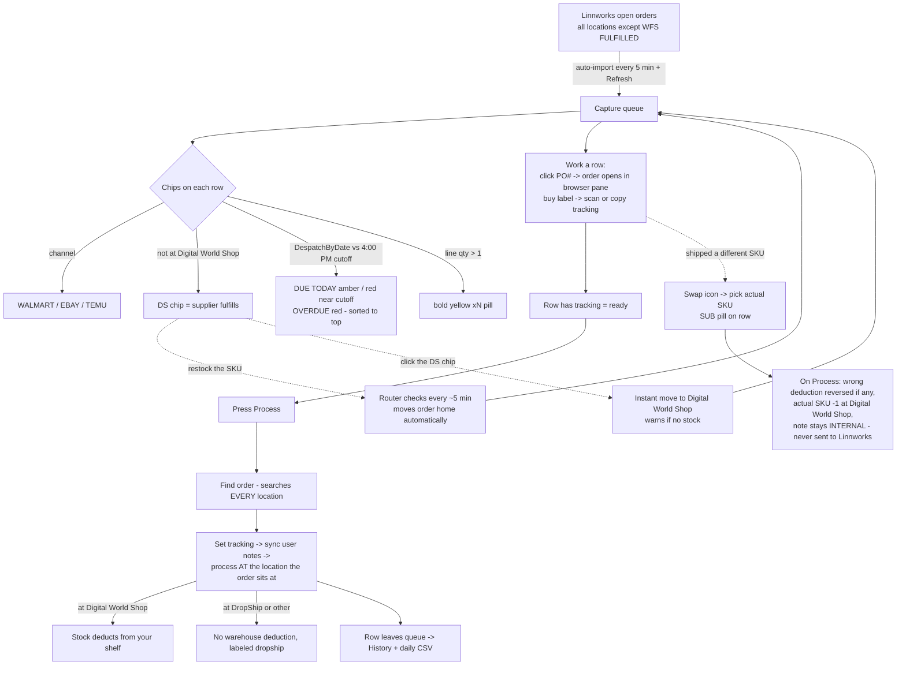

# Capture tab — how it all works (the brain map)

One sentence: **the queue shows every open order Linnworks knows about; your job is
label + tracking; Process makes Linnworks agree with what actually happened.**

## The five rules

1. **DS chip = supplier's order.** Any order not sitting at Digital World Shop.
   You don't track supplier stock; processing it deducts nothing from you.
2. **"Actually, we have it" = fix the count, nothing else.** Stock page → click
   the number → real qty. The router moves the order home within ~5 min (or
   click the DS chip to move it instantly). Then Process like any other order.
3. **Moves assign responsibility; Process spends the stock.** Moving an order
   never adds or transfers units. Deduction happens only at Process time, for
   the order's qty, at the order's location. Restock +1 → process −1 → net 0
   is the correct paper trail, not waste.
4. **Substituted the item? Mark it, don't do math.** Hover row → swap icon →
   pick the SKU that really shipped. On Process the app reverses any wrong
   deduction, deducts the real SKU, and keeps the "ordered X, shipped Y" note
   internal (app Notes/History/CSV only — Walmart and Linnworks never see it).
5. **Identity problems need per-order surgery.** Wrong/ghost channel SKU =
   relink on the order in Linnworks (mappings only affect future downloads).
   The open-orders popup shows channel SKUs so these are easy to spot.

## Chips cheat-sheet

| Chip | Meaning | Click does |
|---|---|---|
| `WALMART` / `EBAY` | channel | filter chips above the sheet |
| `DS` | order at DropShip (supplier) | move it to Digital World Shop |
| `DUE TODAY` / `OVERDUE` | despatch-by vs 4:00 PM cutoff (Settings) | "Due today" chip filters them |
| `×2` | multi-unit line — pack N units | — |
| `SUB → SKU` | substitution recorded, applies at Process | edit / remove it |

## Capture-only mode (packing station)

The queue, Process, DS logic, and browser pane all disappear. The station just
watches the clipboard for PO#s, takes tracking scans, and mirrors the day to
`Documents\Capture Station\capture-YYYY-MM-DD.csv`. No Linnworks access at all.
